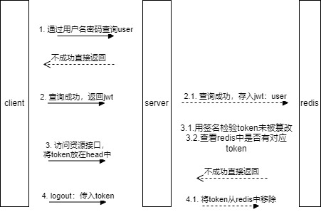

## pom文件
- joda-time：java日期处理工具

## mybatis-plus 使用
1. pom中引入依赖
2. 系统配置中写入配置，yml或properties
      ```yaml
       mybatis-plus:
         configuration:
           # 启用 MyBatis Plus 的日志输出，以便查看 SQL 语句的生成情况
           log-impl: org.apache.ibatis.logging.stdout.StdOutImpl
         global-config:
           db-config:
             table-prefix: ms_
         mapper-locations: classpath:mapper/*.xml
         type-aliases-package: com.tutorial.blog.pojo
      ```
除了在配置文件里写以外，还可以在`Config`类中注入配置<br>
【遇到问题】配置不生效，使用配置类也不生效，比如：
- 表前缀配置不生效，sql查询没有表前缀字符串
- 找不到sqlsession，无法创建mapper的错误
```
Error creating bean with name 'tagsMapper': Unsatisfied dependency expressed through field 'tagMapper'; nested exception is org.springframework.beans.factory.BeanCreationException: Error creating bean with name 'tagMapper' defined in file [D:\WorkDir\cloned\blog-app\backend\target\classes\com\tutorial\blog\dao\mapper\TagMapper.class]: Invocation of init method failed; nested exception is java.lang.IllegalArgumentException: Property 'sqlSessionFactory' or 'sqlSessionTemplate' are required
```
【解决】确认springboot 和 mybatis版本，用idea在当前后端目录打开工程

3. 创建entity/pojo类，对应数据库中的表，Java中以驼峰命名（对应数据库中小写和下划线连接）
4. 创建mapper层，mapper要集成mybatis的baseMapper，在mapper层中对数据库进行操作。<br>
   - 在mapper层上添加@mapper注解或在MybatisplusConfig类/启动类中添加@mapperScan注解配置扫描mapper路径，**这样告诉springboot这是mapper**
   - 遇到自定义sql，需要创建对应mapper的xml文件，在配置中添加mapper-locations配置，一般放置resources文件夹中，如果不写配置，需要在resource目录下配置开发mapper完全相同路径（比如：resources/com/tutorial/blog/dao/mapper）
5. 后续添加service层，在service实现类中添加@Service注解，在实现类中调用mapper中的方法完成业务操作

### mybatis-plus xml编写

## 登录模块
#### 登录流程


- 用户登录成功后
- 后续操作借助redis，不用再通过数据库进行校验

#### 登录拦截器
通过添加interceptor拦截http请求

#### 在本地直接获取用户信息
希望在controller中 直接获取用户的信息，可以使用threadlocal在拦截器工作时，将信息写入指定threadlocal中。<br>
这样同一个线程内都可以通过在threadlocal中获取全局map信息。（不用去head中取token，然后再上redis中拿信息？）
**确保使用后将threadlocal手动移除，否则会有oom风险**

### 注册流程
